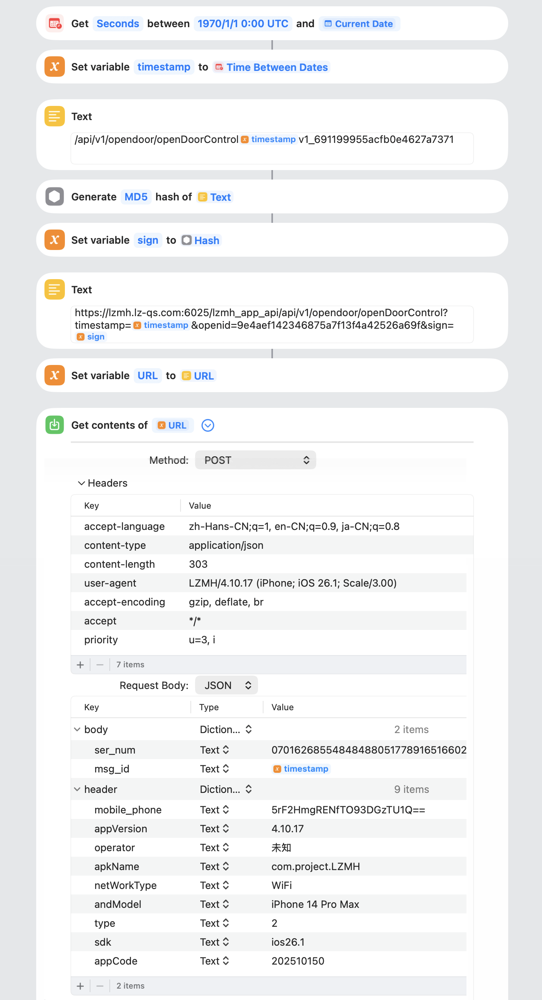

联掌门户的APP做的实在太烂了，想开个门先得点一堆广告，于是研究了一下整了个一键开门的快捷指令，写个文档给自己记录一下。
参考了[v2ex这个帖子](https://cn.v2ex.com/t/1052764)里大佬们的回复，非常感谢🙏

## 提前准备好
- 联掌门户APP
- 任意可以抓包的APP（作为参考，我使用的是Loon的抓包功能）

## 通过抓包获取开门API
1. 启动抓包，打开联掌门户APP，重新登录并成功开门后停止抓包。
2. 在结果里搜索`login`，找到这个API: `https://lzmh.lz-qs.com:6025/lzmh_app_api/api/v2/login/sms?timestamp=xxxxx&openid=&sign=xxxx`，把response里的`value.token`和`openid`都记下来。
```json
{
  "message": "响应成功",
  "value": {
    "token": "xxxxxx",
    "openid": "xxxxxx",
    "first_login_status": 0
  },
  "code": 10000
}
```


3. 在抓包结果中搜索`opendoor`，找到这个API：`https://lzmh.lz-qs.com:6025/lzmh_app_api/api/v1/opendoor/openDoorControl?timestamp=xxx&openid={上一步拿到的openid}&sign=xxxxx`，记录header和body。
header示例：
```
// 不知道哪些是必需的总之全抄了
accept: */*
content-type: application/json
content-length: 303
accept-encoding: gzip, deflate, br
user-agent: LZMH/4.10.17 (iPhone; iOS 26.1; Scale/3.00)
priority: u=3, i
accept-language: zh-Hans-CN;q=1, en-CN;q=0.9, ja-CN;q=0.8
```
body示例：
```json
{
  "header": {
    "appCode": "202510150",
    "appVersion": "4.10.17",
    "apkName": "com.project.LZMH",
    "operator": "未知",
    "netWorkType": "WiFi",
    "andModel": "iPhone 14 Pro Max",
    "type": "2",
    "sdk": "ios26.1",
    "mobile_phone": "xxxxxx"
  },
  "body": {
    "ser_num": "xxxxxxx",
    "msg_id": "xxxxx"
  }
}
```

## 创建快捷指令
`opendoor` API url中的`sign`是需要定期更新的，他是由`MD5(path + timestamp + token)`得到的。
- path: `/api/v1/opendoor/openDoorControl`
- timestamp: unix时间戳
- token: 抓包获得的token

`opendoor` API body里的`body.ser_num`不知道是啥，好像不需要改，`body.msg_id`可以用`timestamp - 1`的值

所以快捷指令里我们需要做的就是获取当前时间戳，生成sign hash值，生成`opendoor` API并发送。
快捷指令我都是凑合用的，可能有更好的做法，就放个截图参考一下思路吧。


